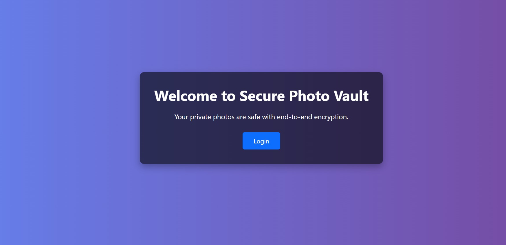
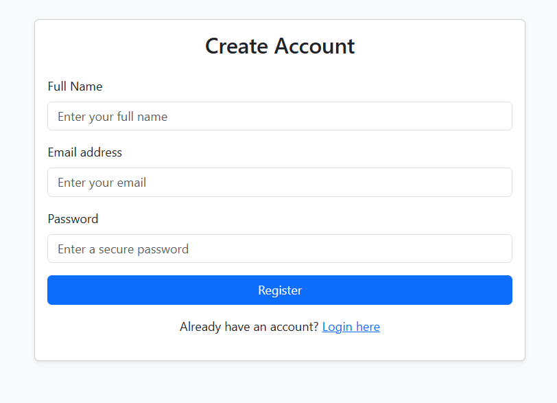
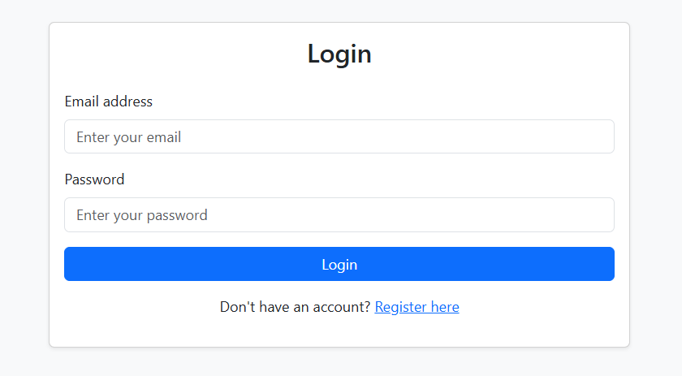
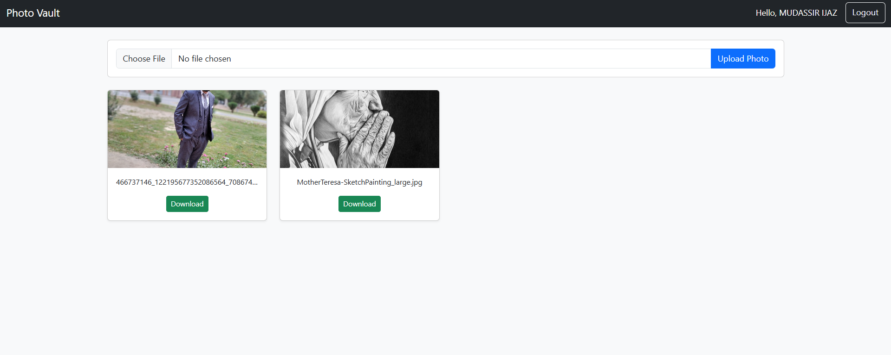

# Secure Photo Vault

A secure per user encrypted photo vault built using CodeIgniter 4, AES-256-GCM encryption, and per-user encryption keys.
Each user’s photos are encrypted with a unique key — even the server admin cannot decrypt another user’s data.

### Demo Link 
https://mudassirijaz.com

# Installation Guide
1. Clone the Project from github repo (git clone https://github.com/Mudassircloud/photo-vault.git)
2. Install Dependencies (composer install)
3. Set env file

CI_ENVIRONMENT = development
Database name, username, and password
app.baseURL = 'your url'

4. Create a MySQL database
5. RUn migration (php spark migrate).
6. Start Server (php spark serve).

# Key Generation & Encryption/Decryption Flow

1. User Registration

-> A unique 256-bit AES key is generated for each user using bin2hex(random_bytes(32)).

-> The key is stored in the database under the vault_key column.

-> User passwords are hashed securely using password_hash().

2. User Login

-> The user’s record is retrieved from the database using their email.

-> Password is verified with password_verify().

-> If correct, session variables are set: isLoggedIn, user_id, vault_key, and name.

3. File Upload (Encryption)

-> The user’s vault_key is retrieved from the session and converted from hex to binary.

-> Photos are encrypted using AES-256-GCM with openssl_encrypt().

-> The encrypted file is saved as .enc including IV + TAG + encrypted content.

4. File Download / Preview (Decryption)

-> Encrypted file is read and IV, TAG, and ciphertext are extracted.

-> openssl_decrypt() is used with the user’s key to decrypt the photo.

-> Decrypted file is displayed in the browser or sent as a download.

5. Security Guarantee

-> Each user has a completely independent encryption key.

-> Server administrators or anyone with database access cannot decrypt files.

-> No plaintext images are ever stored on disk.

# Screenshots

