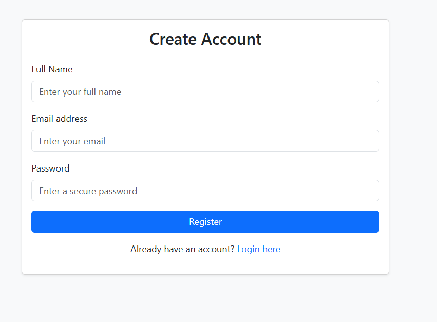
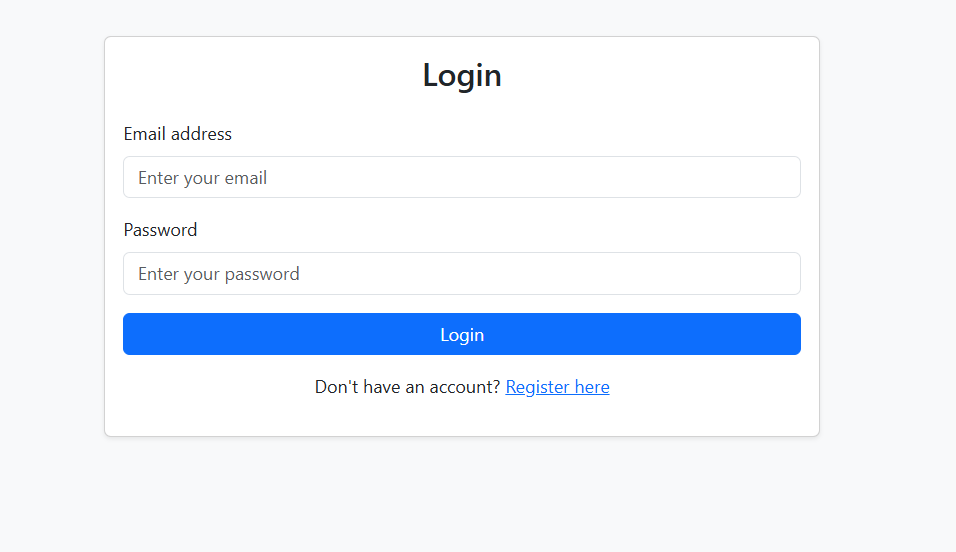

# Secure Photo Vault

A secure per user encrypted photo vault built using CodeIgniter 4, AES-256-GCM encryption, and per-user encryption keys.
Each user’s photos are encrypted with a unique key — even the server admin cannot decrypt another user’s data.

# Installation Guide
1. Clone the Project from github repo (git clone https://github.com/Mudassircloud/photo-vault.git)
2. Install Dependencies (composer install)
3. Set env file

CI_ENVIRONMENT = development

Database name, username, and password

app.baseURL = 'your url'

4. Create a MySQL database
5. RUn migration (php spark migrate).
6. Start Server (php spark serve).

## ScreenShots

